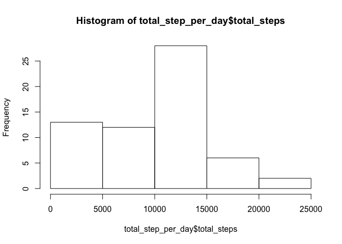
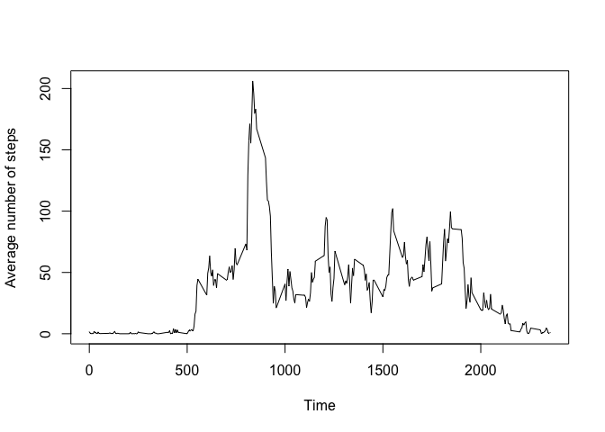
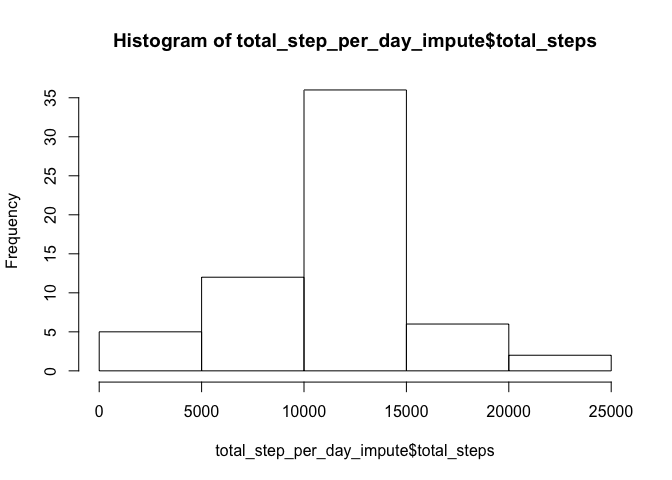
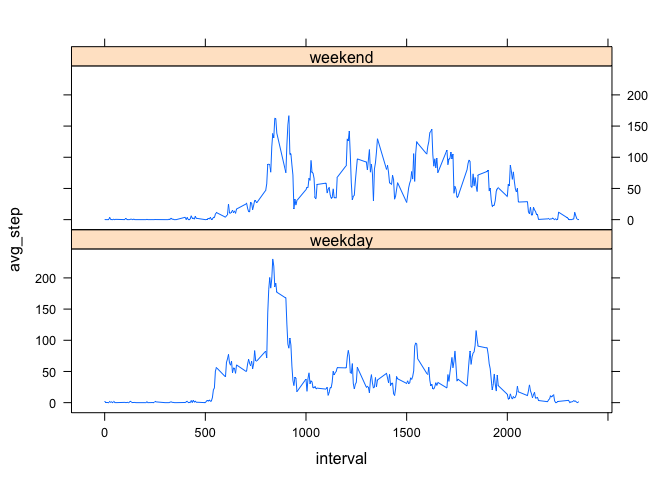

# Reproducible Research: Peer Assessment 1

## Loading and preprocessing the data

```r
activity <- read.csv('./activity.csv', header = TRUE)
# transform the factor date into actual date
activity <- transform(activity, date = as.POSIXct(strptime(date, format = "%Y-%m-%d")))
```


## What is mean total number of steps taken per day?

1. Calculate the total number of steps taken per day


```r
library(dplyr)
#with(activity, tapply(steps, as.factor(date), sum))
total_step_per_day <- activity %>% 
    group_by(date) %>% 
    summarize(total_steps = sum(steps, na.rm = TRUE))
total_step_per_day
```

```
## Source: local data frame [61 x 2]
## 
##          date total_steps
## 1  2012-10-01           0
## 2  2012-10-02         126
## 3  2012-10-03       11352
## 4  2012-10-04       12116
## 5  2012-10-05       13294
## 6  2012-10-06       15420
## 7  2012-10-07       11015
## 8  2012-10-08           0
## 9  2012-10-09       12811
## 10 2012-10-10        9900
## ..        ...         ...
```

2. If you do not understand the difference between a histogram and a barplot, research the difference between them. Make a histogram of the total number of steps taken each day


```r
hist(total_step_per_day$total_steps)
```

 


3. Calculate and report the mean and median of the total number of steps taken per day


```r
# summary(total_step_per_day$total_steps)
total_mean <- mean(total_step_per_day$total_steps)
total_median <- median(total_step_per_day$total_steps)
```
The mean and the median are 9354.2295082 and 10395 separately.


## What is the average daily activity pattern?

1. Make a time series plot (i.e. type = "l") of the 5-minute interval (x-axis) and the average number of steps taken, averaged across all days (y-axis)


```r
avg_step_per_interval <- activity %>% 
    group_by(interval) %>% 
    summarize(avg_steps = mean(steps, na.rm = TRUE))
with(avg_step_per_interval, plot(interval, avg_steps, type = "l", xlab = "Time", ylab = "Average number of steps"))
```

 

2. Which 5-minute interval, on average across all the days in the dataset, contains the maximum number of steps?


```r
max_interval <- with(avg_step_per_interval, interval[which(avg_steps == max(avg_steps))])
```
The interval 835 has the maximum number of steps.


## Imputing missing values

Note that there are a number of days/intervals where there are missing values (coded as NA). The presence of missing days may introduce bias into some calculations or summaries of the data.

1. Calculate and report the total number of missing values in the dataset (i.e. the total number of rows with NAs)


```r
missingNum <- sum(is.na(activity$steps))
```
The total number of missing values are 2304.

2. Devise a strategy for filling in all of the missing values in the dataset. The strategy does not need to be sophisticated. For example, you could use the mean/median for that day, or the mean for that 5-minute interval, etc.

The strategy that I use is to use the mean for that 5-minute interval to impute missing data.

3. Create a new dataset that is equal to the original dataset but with the missing data filled in.

The new dataset is activity_impute. 

```r
activity_impute <- activity
# use mean of that 5 minute interval to impute the missing values
# iterate over all 288 5-minute intervals and impute
for (int in avg_step_per_interval$interval){
 activity_impute$steps[is.na(activity_impute$steps) & activity_impute$interval == int] = with(avg_step_per_interval, avg_steps[interval==int])
}
```

4. Make a histogram of the total number of steps taken each day and Calculate and report the mean and median total number of steps taken per day. Do these values differ from the estimates from the first part of the assignment? What is the impact of imputing missing data on the estimates of the total daily number of steps?


```r
total_step_per_day_impute <- activity_impute %>% group_by(date) %>% summarize(total_steps = sum(steps, na.rm = TRUE))
hist(total_step_per_day_impute$total_steps)
```

 

```r
#summary(total_step_per_day_impute$total_steps)
total_mean_new <- mean(total_step_per_day_impute$total_steps)
total_median_new <- median(total_step_per_day_impute$total_steps)
```
The new mean and median are 10766.19 and 10766.19 separately. Both new values are different from previous results, and they have increased due to the imputation. 


## Are there differences in activity patterns between weekdays and weekends?

For this part the weekdays() function may be of some help here. Use the dataset with the filled-in missing values for this part.

1. Create a new factor variable in the dataset with two levels – “weekday” and “weekend” indicating whether a given date is a weekday or weekend day.


```r
activity_impute <- transform(activity_impute, weekDayorEnd = ifelse(weekdays(date) == "Saturday" | weekdays(date) == "Sunday", "weekend", "weekday" ))
```

2. Make a panel plot containing a time series plot (i.e. type = "l") of the 5-minute interval (x-axis) and the average number of steps taken, averaged across all weekday days or weekend days (y-axis). See the README file in the GitHub repository to see an example of what this plot should look like using simulated data.


```r
avg_step_per_interval_weekDayorEnd <- 
    activity_impute %>%  
    group_by(interval, weekDayorEnd)  %>% 
    summarize(avg_step = mean(steps))

library(lattice)
xyplot(avg_step ~ interval | weekDayorEnd, data = avg_step_per_interval_weekDayorEnd, layout = c(1,2), type = 'l')
```

 

From the two panels, we see that weekend activity during the day is more evenly distributed while the weekday activity has some spikes during the morning. Moreover, the user probably gets up later and sleepr later in weekends compared to in weekdays.  
